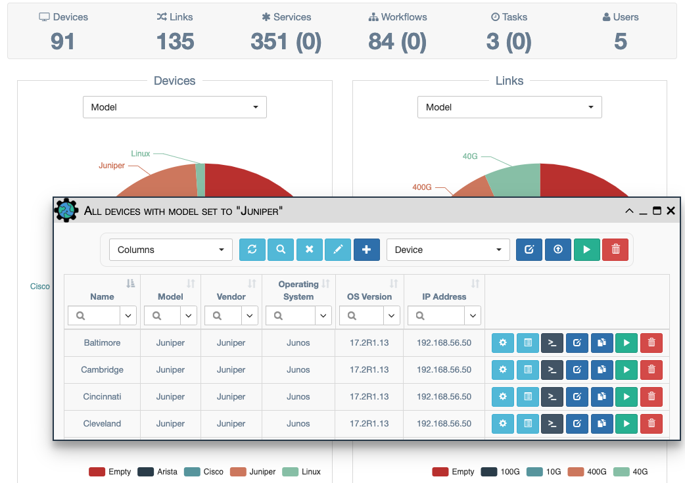
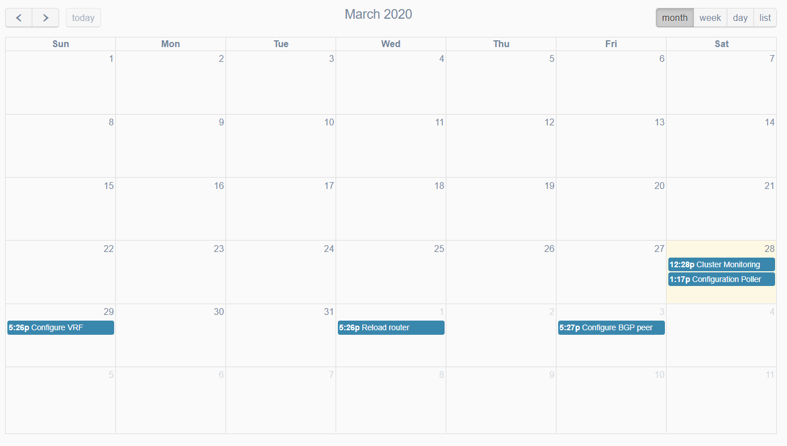

<h1 align="center">eNMS</h1>
<h2 align="center">An enterprise-grade vendor-agnostic network automation platform.</h2>

# Introduction

eNMS is a vendor-agnostic NMS designed for building workflow-based network automation solutions.

It encompasses the following aspects of network automation:
  - **Configuration Management Service**: Backup with Git, change and rollback of configurations.
  - **Validation Services**: Validate data about the state of a device with Netmiko and NAPALM.
  - **Ansible Service**: Store and run Ansible playbooks.
  - **REST Service**: Send REST calls with variable URL and payload.
  - **Python Script Service**: Any python script can be integrated into the web UI. eNMS will automatically generate
a form in the UI for the script input parameters.
  - **Workflows**: Services can be combined together graphically in a workflow.
  - **Scheduling**: Services and workflows can be scheduled to start at a later time, or run periodically with CRON.
  - **Event-driven automation**: Services and workflows can be triggered from the REST API.

# Architecture

___

# Main features

## 1. Network creation

Your network topology can be created manually or imported from an
external Source of Truth (OpenNMS, LibreNMS, or Netbox).
Once created, it is displayed in a sortable and searchable table.
A dashboard provides a graphical overview of your network with dynamic charts.

Inventory                           |  Dashboard
:----------------------------------:|:-----------------------------------:
 |  

- Docs: _[Network Creation](https://enms.readthedocs.io/en/latest/inventory/network_creation/)_

## 2. Network visualization

eNMS can display your network on a world map (Google Map or Open Street Map).
Each device is displayed at its GPS coordinates.
Network topology diagrams can be created using devices and links from inventory, and adding labels for clarity.

Geographical View                |  Network Builder
:-------------------------------:|:-------------------------------:
 |  

- Docs: _[Network Visualization](https://enms.readthedocs.io/en/latest/inventory/network_visualization/)_

## 3. Service creation

eNMS comes with a number of "default services" leveraging libraries such as `ansible`, `requests`, `netmiko`, `napalm`  to perform simple automation tasks. However, absolutely any python script can be turned into a service. If your python script takes input parameters, eNMS will automatically generate a form in the web UI.

Services can be combined into a workflow.

- Docs: _[Services](https://enms.readthedocs.io/en/latest/automation/services/)_, _[Workflow System](https://enms.readthedocs.io/en/latest/automation/workflows/)_

## 5. Configuration Management

eNMS can be used as a device configuration backup tool, like Oxidized/Rancid, with the following features:

  - Poll network devices and store the latest configuration in the database
  - Store any operational data that can be retrieved from the device CLI (e.g ``show version``, ``get facts`` etc.)
  - Search for any text or regular-expression in all configurations
  - Download device configuration to a local text file
  - Use the REST API support to return a specified device’s configuration
  - Export all configurations to a remote Git repository (e.g. Gitlab)
  - View git-style differences between various revisions of a configuration

Search Configuration                          |  Compare Configuration
:--------------------------------------------:|:-------------------------------:
 |  

- Docs: _[Configuration Management](https://enms.readthedocs.io/en/latest/inventory/configuration_management/)_

## 6. Event-driven automation

While services can be run directly and immediately from the UI, you can also schedule them to run at a later time, or periodically by defining a frequency or a CRON expression. All scheduled tasks are displayed in a calendar.

Services can also be executed programmatically: eNMS has a REST API and a CLI interface that can be used to create, update and delete any type of objects, but also to trigger the execution of a service.

- Docs: _[Scheduling](https://enms.readthedocs.io/en/latest/automation/scheduling/)_

___

# Getting started

## Online content

You can follow us on _[Twitter](https://twitter.com/AutomationEnms)_ or _[Linkedin](https://www.linkedin.com/company/enms-automation)_ to receive notifications about new training content and releases.

## Training Videos

- _[eNMS Installation](https://www.youtube.com/watch?v=Zu2iLNaZDQc)_
- _[Overview of eNMS](https://www.youtube.com/watch?v=XwU0yom_aY0&t=1205s)_

## Podcasts

- A _[podcast about eNMS and network automation](https://www.pythonpodcast.com/enms-network-automation-episode-232/)_

## Quick Install
    Install python 3.6+ (earlier versions not supported)
    git clone https://github.com/afourmy/eNMS.git
    cd eNMS
    pip3 install -r build/requirements/requirements.txt
    export FLASK_APP=app.py
    flask run --host=0.0.0.0
    Log in (default credentials: admin / admin)
