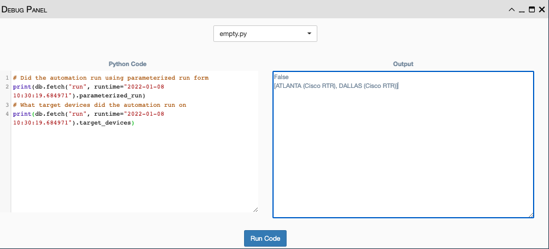

# Debugging

The eNMS application provides a means for any admin user to execute
Python code in the back end, from the web interface. 

On a Windows device this
functionality is accessed by performing `Alt+Shift` and then left-clicking on
the application name in the upper left of the web interface. On a Mac device,
perform `Option+Shift` and click the application name. The following dialog will
open:

The components that are displayed are a dropdown list at the top center of the
dialog, a `Python Code` text box, an `Output` text box, and a `Run Code` button
at the bottom, center of the panel.

The dropdown list has entries that are Python code files located on the server
running the application. The options are:

- `delete_corrupted_edges.py` - This code looks for any duplicate edges in Workflows
and removes any that it finds.
- `empty.py` - This file is empty and allows custom python code to be entered
and executed.
- `functions.py` - The code in this file tests the ability to create a device,
modify a device and delete a device from the application database.
- `getsizeof.py` - This code collects the sizes of several controller variables
used for storing things like connections, logs, and run states.
- `memory_profile.py` - This snippet of code collects the number of objects in
memory and sorts them from highest to lowest in terms of the amount of memory
the object type occupies.  By default, the three object types consuming the most
memory are displayed.  Also displayed are the three largest string and
dictionary objects.
- `sql_performances.py` - This code checks the performance time to create a
number of devices (200 by default) one at a time, fetch those devices one at a
time and delete each of those devices one at a time.  The results are displayed
in the `Output` panel.

Select the desired option in the dropdown list to view and/or edit the code of
the selected file.  Execute the code by clicking the `Run Code` button.  Any
output generated by the code will be displayed in the `Output` panel. 

!!!Note
	Since the code is run from
	the web front end and there are multiple worker processes handling web
	requests, 	there is no guarantee which worker process will handle the code
	execution.