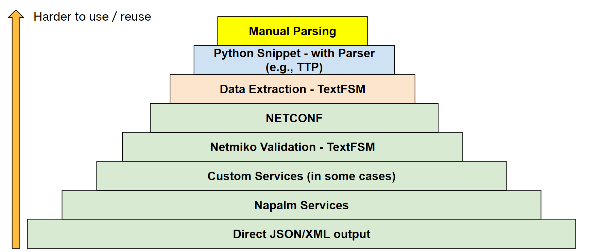
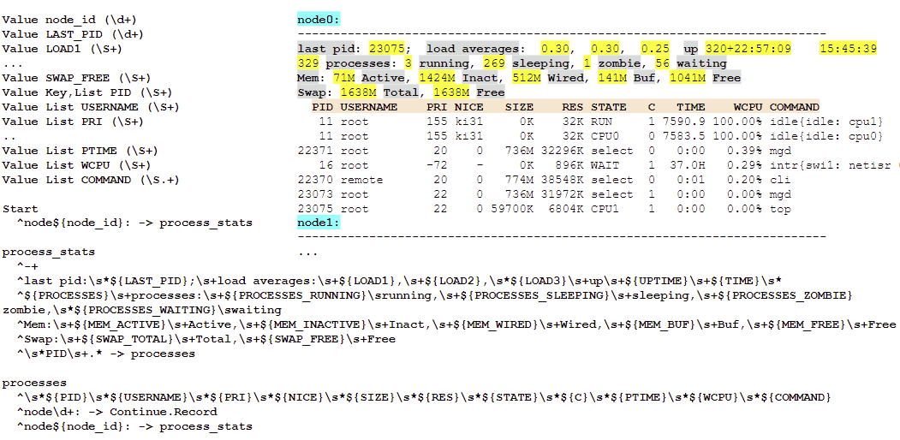
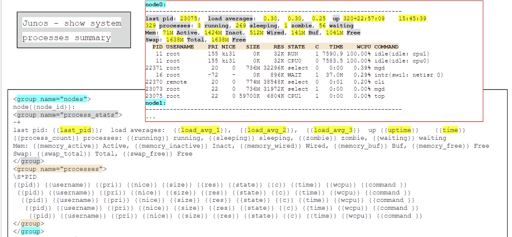

# Service Selection Overview 

Service selection is a very important topic for use in understanding
how to design and build automation workflows.  Each of the service types
available to the system performs a specific action and has strengths and
weaknesses that should be known.

## Structured Data

In network automation, devices or device components may have interfaces
that do not return structured data.  Structured data refers to data obtained
from the device that is easily index-able to its individual elements. In other
words, structured data is data that does not need to be parsed, whereas
unstructured data must be parsed to isolate an individual data element. There
also exists semi-structured data which is structured but still needs some
amount of parsing to isolate data elements.

Note that eNMS uses structured data dictionaries internally to pass data
along the workflow from service to service. So, using eNMS, the user will
spend a lot of time considering how to either retrieve structured data
directly from the device or most-easily convert unstructured or semi-structured
data from the device to structured data.  This section will discuss and rate
the available built-in service types according to how work-intensive they are
for obtaining structured data. The user can refer to these rating when
considering which service to use for a particular action in the workflow.

## Structured Data - Options 

The following image highlights some of the options for getting structured data 
from services that interact with devices.  In many cases, there is a conversion from 
the device command output (text) into something that a service or workflow can use 
to make decisions, generate a report, or send additional device commands.    



This pyramid attempts to assess how much effort is spent to use (or re-use) an approach
to obtain structured data from a device interaction.  

!!! note

    Manual parsing remains the most popular technique - it is often simple and easy 
    to develop.  With Shared services, you can still re-use the development
    effort in multiple workflows.
    
    Understanding the available options will help you choose the right one for your 
    workflow and service design.
    
## Considerations when looking beyond manual parsing:

This is often a very personal choice.  Here are some questions to keep in mind that 
could affect your decisions:

- Does your device command support JSON/XML output directly?
- Is there a Napalm driver for your device, and what data can it obtain via its 
  Getters?
- Is there already an existing OpenSource or Vendor template (TextFSM, TTP) that will 
  parse the command output?
- Are you spending more time parsing command output than building other logic?
- Is there a lot of detail in the command output and you think you might like to be 
  able to put all of that into a structured form?
- Are you comfortable working with a command parser like TextFSM to develop your 
  own template(s)?    

## Direct JSON or XML Command Output

In the case where the device is capable of giving a fully-structured data
response, there is no additional parsing needed. This is often the best solution
possible - and is available when the target device command supports JSON or XML output.

This is most often possible with the 
[Netmiko Validation Service](../automation/servicetypes/netmiko_validation/) - and 
the availability of this option depends on the device operating system and
the specific command(s) used.
 
For example, Juniper devices can support a pipe operator to convert output to JSON 
or XML:

- `show interfaces | display json`. 
- `show interfaces | display xml`.

!!! note

    With commands like this, you should configure the Conversion Method in Step 4
    of the Service Editor to either XML dictionary or JSON dictionary.

    For JSON, this is a direct JSON conversion - which is most likely a dictionary. 
    However, it will still support other JSON types like an array (list).


## Napalm Services 

NAPALM provides a unified API to send commands to different device vendors - primarily
to get or manipulate configuration and retrieve data (Getters).  

NAPALM drivers must be available - see the [NAPALM information](#more-information-napalm) 
for links to the available Core and Community drivers.  The supported devices/platforms are 
typically fewer than [Netmiko](#more-information-netmiko).

The Getter operations include commands like `get_config`, `get_facts`, `get_interfaces`,
`get_interfaces_ip`,`get_bgp_config`, etc.  

!!! note 

    Before selecting a specific Getter operation, you should check your platform to see 
    what is supported.  

!!! note 

    In the NAPALM Getters Service, you can select more than one Getter command to
    request.


## Custom Services

If a Custom Service already exists for a specific device that provides structured data,
this is also easy to re-use.
  
Writing a Custom Service that runs several commands and operates on their results for a
device type: 

- can reduce the number of duplicated service and/or custom parsing/filtering logic 
  for complex device interactions.
- can also be a great deal of work to get started.

This option is listed for completeness - and internally, it may use things like 
TextFSM (or TTP).

## Using TextFSM 

### Using TextFSM with a Netmiko Validation Service 

This should use the TextFSM templates installed from the Network-to-Code repository 
listed below with the following environment variable set: 
```
export NET_TEXTFSM=/path/to/ntc-templates/templates/
```  

In this case, one only has to **check** the `Use TextFSM` option with the Netmiko 
Validation Service:


!!! note 
    
    The Netmiko Validation command is matched against the contents of the 
    Network-to-Code 'index' file basd on the platform (netmiko driver) and the 
    command.
    
For example, this line in the index will use that textfsm file for `cisco_ios` devices 
and match the full (`show ip route`) or abbreviated (`sh ip r`) command text.   
```
cisco_ios_show_ip_route.textfsm, .*, cisco_ios, sh[[ow]] ip r[[oute]]
``` 

## NETCONF 

There are two different options if the target device supports the NETCONF 
protocol - using the NETCONF Service (ncclient) or the Scrapli NETCONF Service.

### NETCONF Service (ncclient)

Since NETCONF is XML based, retrieving configuration data using NETCONF can
easily be converted to structured data by converting the response to an XML 
dictionary:


### Scrapli NETCONF Service

This is another option for using NETCONF.

## Multiple commands - Scrapli

A relatively new addition to eNMS, the [Scrapli Command Service](../automation/servicetypes/scrapli_command/) 
provides the ability to send multiple commands (and to received multiple responses).

While the eNMS [Scrapli Command Service](../automation/servicetypes/scrapli_command/)
does not support it today, the lower-level [Scrapli API](#more-information-scrapli) 
supports using TextFSM templates.

## Using TextFSM with a Data Extraction Service 

If you write your own TextFSM templates (i.e., without installing them per above),
the Data Extraction Service is another option to consider.  You can use TextFSM 
to parse previous command results and extract desired information.

In this example is a simple TextFSM template (from the Network-to-Code repository)
that shows how the Data Extraction Service works:


That produces the following Service result: 


 

## Python Snippet (or Postprocessing) with a Parser (TextFSM, TTP, or Other)

Either Postprocessing code or a separate Python Snippet can take a result and 
parse the text with the aid of a parser like [TextFSM](#more-information-textfsm) or 
[TTP](#more-information-ttp). 

This is still less work than manual parsing - if you already have the [TextFSM](#more-information-textfsm) or 
[TTP](#more-information-ttp) template.

### TTP Example - using programmatically 

There is not yet an automatic approach for using TTP with eNMS.  So, if you want to use 
TTP templates, this is the approach to take.

```python
from ttp import ttp
device_output = get_result("Your Device Command Service", device=device.name)["result"]

from ttp import ttp
ttp_template = "" # this should be the text of the TTP template  
parser = ttp(data=device_output, template=ttp_template)
parser.parse()

parsed_data = parser.result()[0]

results["success"] = True
results["result"] = parsed_data
```

### TextFSM Example - using programmatically    

This is an alternative to automatically using TextFSM with the Netmiko Validation Service
or to using a Data Extraction Service.  

The other approaches are likely better; this is included for completeness.

```python 
import textfsm
from io import StringIO

device_output = get_result("Put Device Command Service Here", device=device.name)["result"]
text_fsm_template = ... # put your text FSM template here (string) 

parser = textfsm.TextFSM(StringIO(text_fsm_template))
parsed_data = parser.ParseText(device_output)

results["success"] = True
results["result"] = parsed_data 
results["headers"] = parser.header  # just for documentation  
```

## Manual Parsing 

Any manual decoding/parsing of the text results of a previous command (e.g., from 
a [Netmiko Validation Service](../automation/servicetypes/netmiko_validation/))
falls into this category.

This can use any parsing technique - including functions like `str.split()` or
 `regex` functions.  
 
```python
# This is an example for a Cisco 'show int br' command on a single device. 
#             Intf       Intf        LineP              Encap  MTU        BW
#              Name       State       State               Type (byte)    (Kbps)
#--------------------------------------------------------------------------------
#    interface_name       down        down               ARPA  1500      10000000
results["initial"] = results["result"]
headers = ["name", "intf state", "linep state"]
results["result"] = {
    line.split()[0]: {
        headers[idx]: value
        for idx, value in enumerate(line.strip().split(maxsplit=4)[0:3])
    }
    for line in results["initial"].strip().splitlines()
    if "down" in line  # filter to look for 'down' or 'admin-down' lines
}
```

## More information: TextFSM 

### Links 

- [Python package](https://pypi.org/project/textfsm/). 
- [Python documentation](https://pyneng.readthedocs.io/en/latest/book/21_textfsm/README.html).
- [TextFSM source code](https://github.com/google/textfsm). 
- Network-to-Code TextFSM templates:
  - [GitHub Repository](https://github.com/networktocode/ntc-templates). 	
  - [Index (template list)](https://github.com/networktocode/ntc-templates/blob/master/ntc_templates/templates/index).

### Example TextFSM template 

Refer to the TextFSM documentation and the Network-to-Code examples for information 
on how to build a command.

When a template does not exist for your device/operating system/command, you can write
one.   This is an example TextFSM template for the Junos `show system process summary`


   

### Debugging Your Own TextFSM templates 

You can test your TextFSM template(s) by running the `textfsm/parser.py` file with 
your template definition and the device output you want to parse:

```
parser.py your_textfsm_template.txt command_output_to_parse.txt
```

## More information: NAPALM

### Links 

- [Main documentation](https://napalm.readthedocs.io/en/latest/).
- [Supported Core drivers](https://napalm.readthedocs.io/en/latest/index.html#supported-network-operating-systems)
  (Arista EOS; Cisco IOS, IOS-XR, NX-OS, Juniper JunOS).
- [Getters support matrix](https://napalm.readthedocs.io/en/latest/support/index.html#getters-support-matrix).
- [NAPALM optional arguments](https://napalm.readthedocs.io/en/latest/support/index.html#optional-arguments).
- [NAPALM Community drivers](https://github.com/orgs/napalm-automation-community).

## More information: TTP 

The Template Text Parser (TTP) is another Python package that allows you to develop
templates to parse command output to produce structured data. 

### Links 

- [Python package](https://pypi.org/project/ttp/). 
- [Documentation](https://ttp.readthedocs.io/en/latest/). 
- [Samples](https://github.com/dmulyalin/ttp_templates). (just a few)
- [Slack channel](https://networktocode.slack.com/archives/C018HMJQECB).

### Example TTP 

Refer to the TTP documentation and the Network-to-Code examples for information 
on how to build a command parser.

When a template does not exist for your device/operating system/command, you can write
one.   This is an example TTP template for the Junos `show system process summary`
Junos - show system process summary



### Debugging Your Own TTP templates

This is a command line that you can use to test your TTP templates. 
```
ttp --data ./show_system_processes_summary.txt --template ttp_test.txt --logging DEBUG --outputter json
```

## More information: NETCONF 

Links 

- [ncclient Documentation](https://ncclient.readthedocs.io/en/latest/). 
- [ncclient GitHub](https://github.com/ncclient/ncclient).  
 
## More information: Scrapli

Links 

- [Scrapli documentation](https://carlmontanari.github.io/scrapli/).


## More information: Netmiko 

Links

- [Documentation](https://ktbyers.github.io/netmiko/#api-documentation).
- [Supported Platforms](https://ktbyers.github.io/netmiko/PLATFORMS.html). 
- [GitHub](https://ktbyers.github.io/netmiko).


