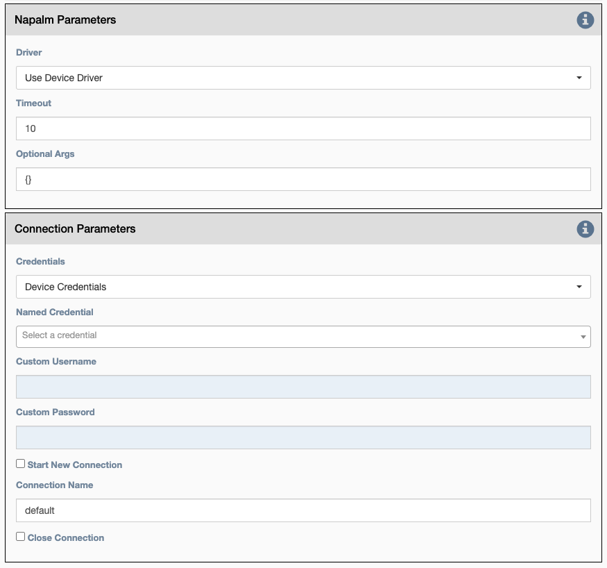

These parameters are common to all Napalm Services.

## Napalm Parameters

- `Driver`: Which Napalm driver to use when connecting to the device. If `Use Device Driver`is 
   choosen, the driver defined at
   device level (`napalm_driver` inventory property of the device) is used.
   Otherwise the driver defined at service level (`Driver` property of
   the service) is used.
- `Optional arguments`: Napalm supports a number of optional arguments
   that are documented 
   [here](https://napalm.readthedocs.io/en/latest/support/index.html#optional-arguments).
     
## Connection Parameters

- `Credentials`: Select between:
    - `Device Credentials`: The application will select the most appropriate credential
      object for each device. If there are multiple credentials available, the 
      `Type of Credential` and `Priority` properties become a tiebreaker.
    - `Named Credentials`: Allows users to reference a specific credential for all targets. Selecting this 
      option requires additional selections below (section `Named Credential`).
    - `Custom Credentials`: Allows users to store a credential against this service. Selecting this 
      option requires additional selections below (sections `Custom Username` and `Custom Password`).
      
!!! Advice

    `Named Credentials` selections will persist through duplicating a service, unlike `Custom Credentials`. 
    [For details on creating a `Named Credential` take a look at this page.](../../administration/credentials.md) 

- `Named Credential`: Select from a list of user created credential objects. 
- `Custom Username`: User provided username, stored against this service.
- `Custom Password`: User provided password, stored against this service.

- `Start New Connection`: **before the service runs**, the current
  cached connection for the device is discarded, and a new one is started.
    
- `Connection Name`: If changed to something other than `default`, the
  connection will be cached as a separate connection to that same device.
  This allows for multiple simultaneous "named" connections to a single
  device.
    
- `Close Connection`: once the service is done running, the current
  connection will be closed.
