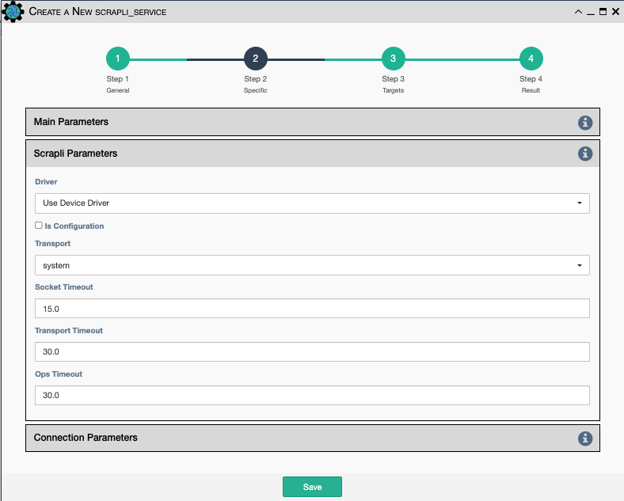

These are the common Scrapli Parameters for Scrapli Commands and Scrapli Data Backup
Services.

## Scrapli Parameters

- `Driver` - Scrapli driver to use. Currently, it supports:
    - `Device Driver` - Use the driver assigned to the device in the application inventory
    - `arista_eos`.
    - `cisco_iosxe`.
    - `cisco_iosxr`.
    - `cisco_nxos`.
    - `juniper_junos`.
- `Is Configuration` -  Should the device be put in config mode before
  issuing the commands?
- `Transport` - Supports using the following transport plugins:
    - `system` - Wrapper around OpenSSH/System available SSH binary.
    - `paramiko` - Wrapper around paramiko library.
    - `ssh2` - Wrapper around ssh2-python library.
- `Socket Timeout` - When socket is created it is initially set with this timeout.
- `Transport Timeout` - When system transport is selected, this is the timeout used.
If ssh2 or paramiko are the selected the timeouts for each respective library is used.
- `Ops Timeout` - This timeout is used for individual operations (commands).
    
## Connection Parameters

- `Credentials` - Select between:
    - `Device Credentials` - The application will select the most appropriate credential
      object for each device. If there are multiple credentials available, the 
      `Type of Credential` and `Priority` properties become a tiebreaker.
    - `Named Credentials` - Allows users to reference a specific credential for all targets. Selecting this 
      option requires additional selections below.
    - `Custom Credentials` - Allows users to store a credential against this service. Selecting this 
      option requires additional selections below.
      
!!! Advice

    `Named Credentials` selections will persist through duplicating a service, unlike `Custom Credentials`. 
    [For details on creating a `Named Credential` take a look at this page.](../../administration/credentials.md) 

- `Named Credential` - Select from a list of user created credential objects. 
- `Custom Username` - User provided username, stored against this service.
- `Custom Password` - User provided password, stored against this service.

- `Start New Connection` - **Before the service runs**, the current
  cached connection is discarded and a new one is started.
- `Connection Name` - If changed to something other than `default`, the
  connection will be cached as a separate connection to that same device.
  This allows for multiple simultaneous "named" connections to a single
  device.
- `Close Connection` - Once the service is done running, the current
  connection will be closed.
