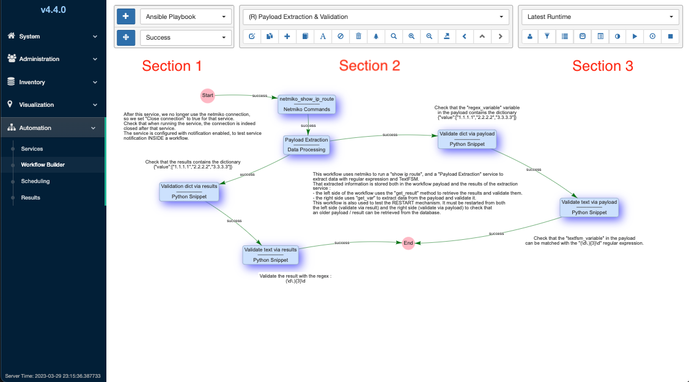

## Overview 

A workflow is a graph of services connected with `success` and `failure`
edges. If a service is executed successfully, the workflow continues
down the `success` path to the next service, otherwise it goes down the
`failure` path. A workflow is considered to have run successfully if the
`"End"` service is reached. For this reason, a `failure` edge should be
used for:

- Recovery from a failure, using some corrective action, that allows
  the workflow to then continue on the `success` path
- Cleanup or finalization of the state of a device, following the
  failure, before the workflow ends

Workflows are managed from `Automation -> Workflow Builder`, and they are listed
in the `Automation -> Services` table. When a workflow is running, the results
are automatically updated in real-time in the workflow builder, and its
status is listed in real-time in the `Automation -> Results` table.

## Workflow Builder

The Workflow Builder's panel is organized into 3 blocks of controls:

- Section 1: Services and Edges Creation controls:

    - The first row lets the user choose a service type and click on the
      `"+"` button to create a new service that will be added to the workflow.
    - On the second row, the button toggles the mode between `"Edge
      Creation"` and `"Motion"` which allows the services to be repositioned.

- Section 2: Edit and View Workflow controls:

    - `Pull-down`: Choose which Top Level Workflow to display
    - `Edit` current workflow
    - `Duplicate` current workflow into a new workflow
    - `Create` (a new) top level workflow
    - `Add existing services` to the current workflow, which supports:
    
        - Deep Copy: creates a new localized copy of an existing service (or 
          workflow) within the scope of the current workflow
        - Shallow Copy: adds a reference to an existing shared service (or 
          workflow) into the current workflow. Shallow copy only works on
          shared services; attempting to shallow copy a non-shared service will
          result in an error alert in the UI. Note that changing a shared
          service causes the change to impact all workflows that use that
          service.)
   
    - `Create a text label`
    - `Skip (or Unskip)` selected service(s) such that they do not run during
      execution
    - `Delete` selected service(s) or edges(s)
    - `Workflow tree`: display all services of the workflow in a tree structure
    - `Zoom In`: makes the display aspect ratio larger (also achievable via the
       mouse wheel)
    - `Zoom Out`: makes the display aspect ratio smaller (also achievable via
       the mouse wheel)
    - `Previous workflow`: functions like the Back-button of the browser
    - `Switch to Parent workflow`: transitions back to the parent workflow if
      a subworkflow has been double-clicked for drill down
    - `Next workflow`: functions like the Next-button of the browser

-   Section 3: Run or Stop the workflow, Browse Logs and Results

    - `Pull-down`: Select which runtime to display. `Normal Display` is without
      results. `Latest Runtime` shows the latest set of results and refreshes
      when new results become available. Selecting a specific runtime result
      will prevent refreshing for any new runtimes and will continue to
      display that historical run.
    - `Personal or All Runtimes`: toggle between listing all runtimes for this
      workflow or only runtimes from the current user. This also controls
      which runtime is displayed when `Latest Runtime` is selected.
    - `View Logs` for the selected runtime
    - `Results Tree`: show a tree of per-service results with buttons to view
      that service's logs or the per-device results table.
    - `Result Comparison`: visually compare results across runtimes, within the
      same runtime, across the same or different services, and between the
      same device or different devices.
    - `Run the Workflow`: using its saved parameters and the saved parameters
      of its contained services
    - `Parameterized Run`:  run the Workflow by first popping up a user input
      panel to prompt for select parameters (so that those parameters, such
      as which device targets to run on, do not need to be saved inside the
      workflow).  The list of parameters to prompt for are set in Step1 of
      the workflow editor.
    - `Stop the Workflow`:  the workflow will stop once the devices-in-progress
      finish their current service. This feature is also available from a button
      in the `Automation -> Results` table along side each result status.

!!! note

    **Mouse Control**
    
    Many of the above actions are also available from right-click mouse menus.
    Clicking on the background, on a service or on an edge generates
    different menus.
    
    To select one or multiple services:
    
    - Left-click to select one service, Ctrl(or Cmd on Mac) + left-click to add to the
      selection
    - Keep right-click pressed and draw a rectangle.  Upon release, everything
      inside is selected
    - Right-click on a service will select the service and popup the 
      right-click menu for that service
    
