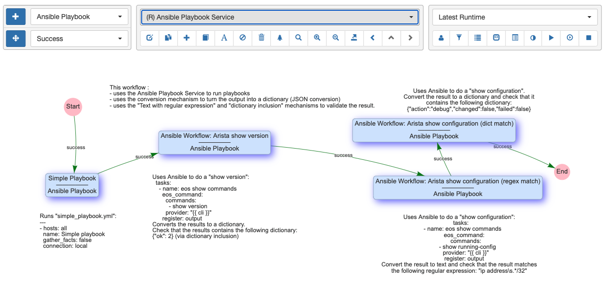

# Features

## Creation of the network

Network topology can be created manually or imported from an external 
Source of Truth (OpenNMS, LibreNMS, or Netbox). Once created, it is displayed in
a sortable and searchable table. A dashboard provides a graphical overview of 
the network with dynamic charts: clicking on a portion of a graph opens an
inventory table panel to that group of data.

Once device and circuit network data has been created, related data can be
grouped into pools.

## Network Visualization

eNMS can display network data on a world map (Google Map or Open Street Map). 
Each device is displayed at its GPS coordinates. Click on a device to display 
its properties, configuration, or start an SSH terminal session.

Colocated devices can be grouped into geographical sites (campus, datacenter, 
\...), and displayed logically with a force-directed layout.

## Services and Workflows

Services are a set of adaptable, extensible, and reusable components that
encapsulate a single unit of work or device interaction. Workflows are made up
of one or more services (or sub-workflows) that represent a series of distinct
steps to accomplish a complex task. They are a visual representation of a
network automation activity. When a workflow is executed, its status is updated
in real-time on the web UI, each service will be continually updated with
current status information. Security features include activity logging,
role-based access control, and credentials management.

## Configuration Management

eNMS can be used as a network device configuration backup tool and replace 
platforms such as Oxidized/Rancid.  It supports the following features:

-   Communication over standard protocols like SSH, REST, or NETCONF
-   Poll network elements and store the latest configuration in the database.
-   Search for any text or regular-expression in all configurations.
-   Download device configuration to a local text file.
-   Use the REST API support to return a specified device's configuration.
-   Export all configurations to a remote Git repository (e.g. Gitlab)
-   View git-style differences between various revisions of a configuration

## Event-driven automation

While services can be run directly and immediately from the display, they can 
also be scheduled to run at a later time, or periodically by defining a
frequency or a CRON expression. All scheduled tasks are displayed in a calendar
or in tabular form.

Services can also be executed programmatically, eNMS has a REST API and a CLI 
interface that can be used to create, update and delete any type of objects, 
but also to trigger the execution of a service.
