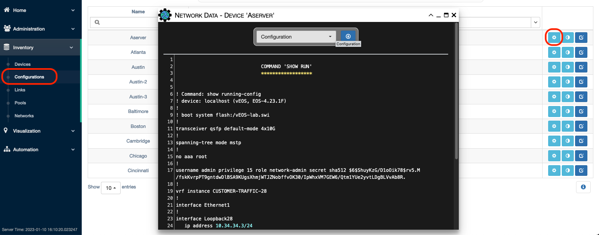

# Configuration Management

eNMS can be used as a device configuration backup tool, like oxidized/rancid, with the following features:

-   Poll network devices and store the latest configuration in the
    database
-   Store any operational data that can be retrieved from the device
    CLI (e.g `show version`, `get facts` etc.)
-   Search for any text or regular-expression in all configurations
-   Download device configuration to a local text file
-   Use the REST API support to return a specified device's
    configuration
-   Export all configurations to a remote Git repository (e.g. Gitlab)
-   View git-style differences between various revisions of a
    configuration

## Device configuration

Configurations are retrieved by "Netmiko Data Backup" service, which then:

- Fetches the device configuration or operational using Netmiko or Napalm 
- Updates the device `Configuration`, `Operational Data`, or `Specialized
  Data` property, depending on which one is selected in the service.

For some devices, the configuration cannot be retrieved with only a
Netmiko command. In this case, one can either use the "Napalm Data
Backup" service to substitute a napalm getter, such as get_config, in
place of retrieving the configuration via CLI command. 

Alternatively, there is the option to create one's own configuration backup 
custom service(s) if required. Targets are defined at the service level, like
any other service.

Another Alternative is to extend the `setup/properties.json` file to include
extra specialized data properties so that Netmiko and Napalm Data Backup can
be used to collect and store additional data sets.

## Push configurations to git

Collected configurations and operational data are written to local text files,
located in `/network_data/`, which are mapped in the `settings.json` to a git
repository. Upon retrieving the current configuration from a device, the
config is added to the database, as well to the local text file. Git is
used for storing historical revisions of the data, and each additional
instance of eNMS can retrieve the Git history using the
`Admin Button -> Fetch Git Configurations Button`. Git fetch can also be
configured in the cron to periodically get triggered through the CLI to
update the Configurations that were pushed into Git by another instance
of eNMS.

!!! attention

    Multiple instances of eNMS pushing to the same `/network_data/` repository
    may result in merge conflicts on some or all instances which will halt
    further updates. 

    To prevent this, the user can install a custom merge driver in the
    `/network_data/` repo that allows git to automatically merge based on the
    most recent commit, as detailed in the [Installation docs](../base/installation.md#network-data-merge-driver).

# Search and display the configuration

From the `Inventory -> Configurations` tab, the user can search for a specific 
word, a string that is included in a pattern or a regular expression in 
the current configuration of all devices, using the *Configuration*
column. eNMS will filter the list of devices based on whether the
current configuration of the device contains the search criteria. Select
the "Lines of Context" slider at the top of the UI to see, up to 5
lines, before and after, the specified word that was searched.

By clicking on the `Network Data` button on the right of the screen, one
can display the device Configuration (or select Operational Data).

By clicking on the `Historic` button on the right of the screen, one can
view the differences between various revisions of the device
configuration.

