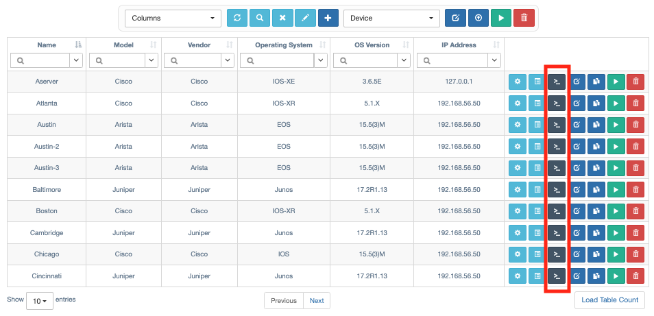

# WebSSH Connection
WebSSH allows a connection to a device where eNMS handles the establishment 
of a Telnet or SSH session to the device using the information stored in the
network inventory.  There are multiple ways to establish a WebSSH connection.

## From Devices Inventory Table

You can connect to a device by clicking on the `Connect` button of a device
entry in the `Inventory / Devices` table as shown below.

The following dialog will appear:

You can configure the following parameters:

- `Property used for the connection`: This dropdown list is used to select one
of the following options:
	- `IP address`: This is the IP address stored in inventory for the device.
	- `Name`: This is the name property of the selected device.
	- `Console 1`: The value stored in the Console 1 property for the device.
	- `Console 2`: The value stored in the Console 2 property for the device.
- `Automatically authenticate`: (SSH only) eNMS will use the credentials stored
in the Vault (production mode) or the database (test mode) to automatically
authenticate to the network device. By default, `device credentials` are
selected but you can choose `user credentials` or `custom credentials` instead.
Custom credentials are those that you can specify when creating a new device.
- `Protocol`: `SSH` or `Telnet`.

When the session parameters are configured as desired, click the `Web Session`
button to connect to the device.

## From Network Views

You can also connect to a device from one of the views presented by 
`Visualization / Geographical View` or `Visualization / Logical View`.
Right-click on any device and select `Connect`.  You will be presented the same
dialog detailed above.