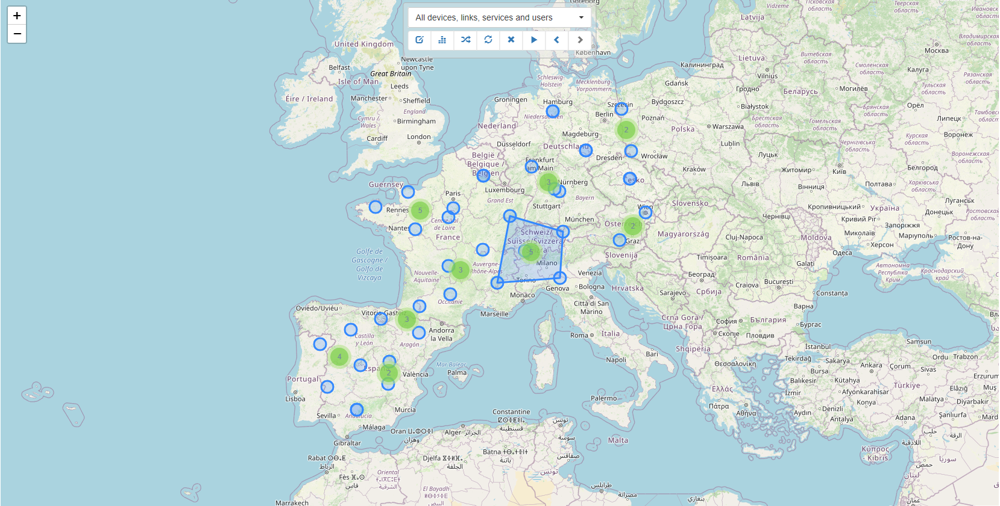

## Geographic View

### 3D Visualization

When the 3D rendering option is set, additional icons appear in the upper 
right corner of the Geographic View panel.  These control how the network data
is displayed.

From left to right:

- View Home: Returns the view to a default view based on the mode (See below)
- Mode: Select from the three viewing modes
    - 2D: Data is presented on a flat scrollable image
    - 3D: Data is presented on a three dimensional model of a globe
    - Columbus View: Data is presented in 3D as a flat surface that slants away
      as if displayed on a table. The image can be scrolled left/right and
      up/down but cannot be rotated like the 3D image
- Map Type: A selection of satellite and street map imagery that can be selected
  for the display
- Navigation Instructions: Displays instructions for how to use the mouse for
  navigating the map display (Zoom, Pan, etc)

Also in the 3D mode, the bottom right corner of the display will have an icon
with 4 arrows.  Click it to put the application into full-screen mode.  Hit Esc
to exit full-screen mode.

#### 3D Visualization - 3D Mode - Satellite Imagery

### Network Data 

Network device images are controlled by the `Icon` 
property of a device. The image type can be set by editing a device in 
`Inventory / Devices` or by clicking on a device in the display to open the 
`Edit Device` dialog and setting the `Icon` property to the desired image type. 

Links appear as lines between two devices on the map. Links have a `Color` 
property that can be set to customize the color of the line drawn for a Link.
This value can be set by editing a link in `Inventory / Links` or by clicking a
link in the display and setting the `Color` property with the desired color 
code. Color format is #RRGGBB where RR is a hex value for red level, GG is a
hex value for green level, and BB is a hex value for blue level.

#### Colocated Devices

The geographical view displays all devices at their GPS coordinates. If
several devices are colocated (i.e. in the same building), they are grouped
together on the map. The 
image is used to identify when multiple devices are at the same location.
All colocated devices can be viewed by clicking on this image on the map.
A dialog will open showing all devices that are at the selected location.

### 2D Visualization

All data in this visualization mode is rendered in 2D in the display. There are
options that are only available in the 2D visualization setting.  For example, 
there are `+` and `-` icons in the upper left that can be used to zoom
in or out respectively.

#### Device Markers

In 2D mode, there are additional markers available for showing devices on the 
map.  Marker type is selected by right-clicking the map and selecting `Type of 
Marker`. The options are:

- Image - (**Default**) The images associated with the `Icon` property of a
  device.  See the Network Data section above for how to set this property.
- Circle - A small blue dot. Recommended for large inventory.
- Circle Marker - A circle with a bold border and translucent fill centered on
  the location of the device. 

#### Tile Layers

There are two types of tiles available in 2D mode:

- Open Street Map - The imagery used to draw the map is from the Open Street
  Map project
- Google Maps - The imagery is from Google Maps

To set the desired tile layer, right-click the map and select `Tile layer` and
then click the desired option.

#### Clustered View

In this view services are grouped together on the map based on their 
proximity to each other. To access the clustered view, right-click on the
map and select `Type of View > Clustered`. Zooming in or out triggers a 
recalculation of clusters. Hovering over a cluster indicator shows which 
locations are included in the cluster by drawing a polygon connecting the outer
sites of those included in the entire cluster. The image below uses the Circle
Marker to indicate device locations on the Open Street Map tile layer.

