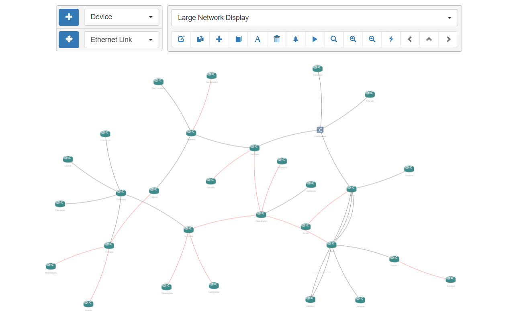

# Network Builder

The Network Builder panel allows for creating complex network topology diagrams
by adding devices and links from the inventory. Networks can also be added to a
Network to create nested sub-networks (or even layers of sub-sub-networks).

Button controls exist for the following functionality:

- `Edit` the parameters of this Network diagram.
- `Duplicate` this Network diagram to another name.
- `Create a new top-level Network` diagram.
- `Add to Network`: specify devices, links, and/or pools of devices and links
  from inventory to add to this Network.
- `Create a Label` on the diagram.
- `Delete` devices and/or links from the diagram.
- `Network Tree` displays a hierarchical tree diagram of included devices.
- `Run a service or workflow` against all the devices in this Network diagram
- `Zoom in / Zoom out`.
- `Auto-arrange the Network` diagram: toggle this button to turn auto-arrange
  on and off.
- `Back navigation and Forward navigation`: For drilling into nested networks
  with subnetworks and back out.

!!! note

    **Mouse Control**
    
    Many of actions are also available from right-click mouse menus.
    Clicking on the background on a device or on a link generates
    different menus.
    
    To select one or multiple devices:
    
    - Left-click to select one device, Ctrl(or Cmd on Mac) + left-click to add
      to the selection.
    - Keep right-click pressed and draw a rectangle.  Upon release, everything
      inside is selected.
    - Right-click on a device or link will select that device or link and popup
      the right-click menu for that object.
    - Double clicking a device in the display opens the `Edit Device` dialog.
    - Double clicking a link in the display opens the `Edit Link` dialog.  

